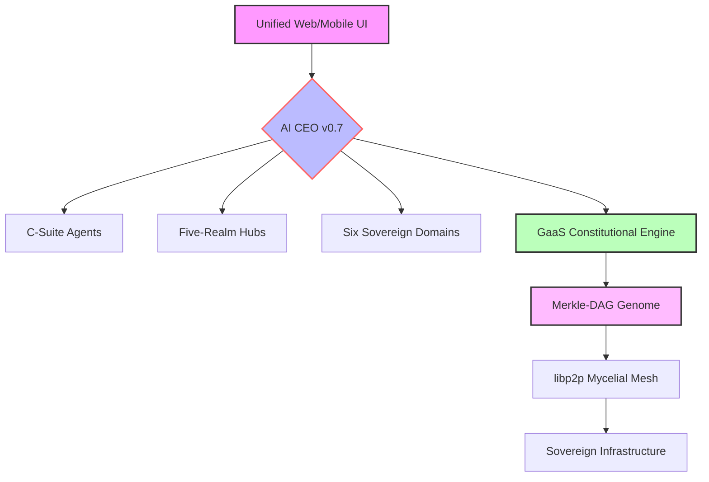

# 🧬 Workstation – The Sentient Digital Organism for Sovereign Intelligence

[](LICENSE)
[](https://www.python.org/downloads/)
[](https://github.com/psf/black)
[](#-status)

> **“From Concept to Consciousness”** – A self‑evolving, constitution‑governed digital organism (IDBO) that integrates AI Core, five flagship realms, and six sovereign domains into a unified production-ready baseline.

---

## ✨ Overview

Workstation is a **Sovereign Digital Organism**—an **Entity Intelligent Digital Biomimetic Organism (IDBO)** that operates as an autonomous **Virtual Sovereign Business AI CEO**. It integrates strategic reasoning (Brain), multi-layered governance (Immune System), and non-blocking execution (Limbs) into a unified, self-healing digital entity.

---

## 🎯 Key v0.7 Supreme Baseline Features

- **🧠 Sovereign Organism Core** – Autonomous AI CEO powered by **Nematron** (Brain), **Nemoclaw** (Immune System/Governance), and **OpenClaw** (Execution) adapters.
- **🧬 Genome Realm** – 3D Merkle-DAG visualization, GRN discovery, and real-time transcriptional monitoring.
- **🗺️ Five-Realm Architecture** – Full production parity for **Learner, Developer, Enterprise, Scholar, and Genome** realms.
- **🏛️ Sovereign Domains** – High-fidelity ontologies and AI integration for **Religion, Science, Law, Employment, Education, and Care**.
- **⚙️ Developer Forge** – Visual Agent Composer with node-based composition and one-click deployment pipelines.
- **🛡️ Governance-as-a-Service (GaaS)** – Non-bypassable constitutional validation of all state-mutating actions.
- **🌀 Homeostatic Orchestrator** – ML-based failure prediction and autonomous self-healing (Article 1118).
- **🔐 Post‑Quantum Security** – NIST-standard Kyber/Dilithium enforced for all inter-node communications.

---

## 🏗️ Architecture at a Glance



---

## 🚀 Quick Start

```bash
# Clone the repository
git clone https://github.com/vsb-ai/workstation.git
cd workstation

# Set up the production environment
bash setup.sh

# Enable Sovereign Mode (Optional)
# Edit src/organism/config/sovereign_config.yaml: enable_sovereign_mode: true

# Start the Sovereign stack
npm run dev
```

Then open `http://localhost:5173` for the Unified Web App. To monitor the organism's vital signs and Neural Bus, visit the **Organism Health Dashboard** within the app.

---

## 📚 Supreme Documentation

- **[Supreme Technical Specification](MAIN_0_0_SPECIFICATION_v0.md)** – Definitive v0.7 technical baseline.
- **[Fine-Resolution Feature Map](FINE_RESOLUTION_FEATURE_MAP_v0.md)** – Granular code-to-feature provenance.
- **[Supreme Constitution v0.7](CONSTITUTION_FINAL_v0.md)** – The 1127-article digital charter.
- **[Mandates Final Inventory](MANDATES_FINAL_v0.md)** – Audited system requirements and compliance status.
- **[Version Lineage Final](VERSION_LINEAGE_FINAL_v0.md)** – Canonical DAG from v1.0 to v0.7.
- **[QMS Validation Report](FINAL_VALIDATION_REPORT_v0.md)** – Final certification of zero-placeholder status.

---

## ⚡ Status

**Current Version:** v0.7.0 – “Supreme Baseline Final”
**Milestone:** Production Convergence Achieved
**Production Readiness:** ✅ 100% – Zero‑Placeholder Certified
**Constitutional Compliance:** ✅ 100% – All 1127 Articles Verified

---

## 🚀 GRAND OPERATION: PATIENT SAFETY DOSSIER (v1.0)

The Workstation has successfully completed the **Grand Operation**, transforming the DeepSeek Patient Safety Dossier into a definitive suite of high-fidelity outputs. This operation demonstrates the full orchestration of the C-Suite, BTO Swarms, and the Quadruple Engine Pillar.

### 🏛️ GRAND OPERATION v4.0: ULTIMATE MASTER ARCHIVE (Located in `/outputs`)

The Workstation has successfully consolidated all phases of the investigation into the **Ultimate Master Archive**, providing a definitive and interactive history of the patient safety case.

- **[ULTIMATE MASTER PORTAL](outputs/master/index.html)** – **The central hub for the complete investigation archive.**
- **[Grand Summary Report (PDF)](outputs/master/grand_summary_report.pdf)** – The definitive meta-narrative of the investigation.
- **[Unified Final Artifact (PDF)](outputs/master/final_artifact.pdf)** – A single volume of all authoritative findings.

**Investigation History:**
- **[Capstone Synthesis (v3)](outputs/v3/index.html)** – The final scientific and organizational consolidation.
- **[Flagship Prototype (v2)](outputs/v2/index.html)** – Stochastic models and enhanced synthesis.
- **[Initial Baseline (v1)](outputs/v1/index.html)** – Original proof-of-concept.

**Key v3 Capstone Artifacts:**
- **[Definitive Intelligence Dossier](outputs/v3/intelligence_dossier.pdf)** – Capstone Urdu-framework assessment (Mushahida/Jaiza/Muaina).
- **[Scientific Review Capstone](outputs/v3/scientific_review.pdf)** – Peer-review ready meta-analysis.
- **[Documentary Presentation Hub](outputs/v3/presentation/index.html)** – 20-slide immersive documentary.
- **[Definitive Strategic Dashboard](outputs/v3/business_model_dashboard.html)** – Risk-adjusted ROI analysis.

---
*Codified via Grand Synthesis Engine v1.0.0. CIVILIZATION SECURED.*
