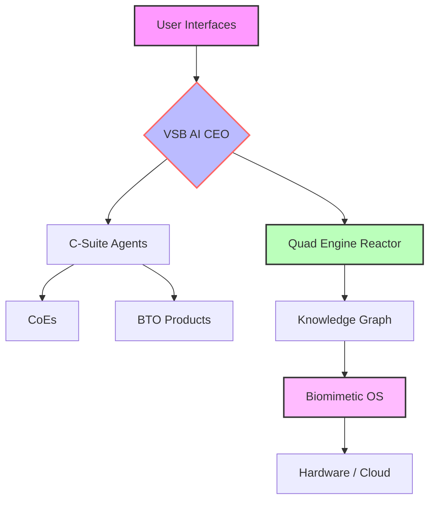

# 🧬 Workstation – The Sentient Digital Organism for Sovereign Intelligence

[](LICENSE)
[](https://www.python.org/downloads/)
[](https://github.com/psf/black)
[](https://github.com/vsb-ai/workstation/actions)
[](https://codecov.io/gh/vsb-ai/workstation)
[](https://discord.gg/workstation)
[](https://twitter.com/WorkstationAI)

> **“From Concept to Consciousness”** – A self‑evolving, constitution‑governed digital organism that integrates AI agents, biomimetic OS, and sovereign legal structures.

---

## ✨ Overview

Workstation is not just a platform; it is a **living digital ecosystem**—an **Intelligent Digital Biomimetic Organism (IDBO)** that grows, learns, and governs itself through a unique blend of **biological principles**, **advanced AI**, and **legal sovereignty**. It powers the **VSB AI CEO**, a full **C‑suite of agents**, specialized **Centers of Excellence (CoEs)**, and a **Build‑to‑Order (BTO) product line**, all orchestrated by the **Quad Engine Reactor** for continuous knowledge assimilation and innovation.

---

## 🎯 Key Features

- **🧠 VSB AI CEO** – Autonomous executive decision‑making with constitutional guardrails.
- **👥 C‑Suite Agents** – CFO, CMO, CTO, CHO, COO – each specialized and collaboratively evolving.
- **🏛️ Centers of Excellence (CoEs)** – Federated knowledge hubs (Data Science, UX, Security, AI Ethics, DevOps).
- **⚙️ BTO Products** – Customer‑configurable solutions with an interactive **Multi‑Step Wizard**.
- **🛡️ Admin Command Console** – High‑level oversight and system governance at `/admin`.
- **🌀 Quad Engine Reactor** – Discovery, Ingestion, Synthesis, Deployment – continuously generating new capabilities.
- **🧬 Biomimetic OS** – Mycelial resilience, ant‑colony coordination, octopus‑like embodiment, immune learning.
- **⚖️ Constitutional Governance** – Wyoming DAO, Articles 1‑1095, ISO 42001, EU AI Act compliant.
- **🔐 Post‑Quantum Ready** – Kyber/Dilithium integrated.

---

## 🏗️ Architecture at a Glance



<!-- TODO: Insert animated GIF of Quad Engine Reactor dashboard (to be created) -->

---

## 🚀 Quick Start

```bash
# Clone the repository
git clone https://github.com/vsb-ai/workstation.git
cd workstation

# Set up Python environment
python -m venv venv
source venv/bin/activate  # or `venv\Scripts\activate` on Windows
pip install -r requirements.txt

# Configure environment variables
cp .env.template .env
# Edit .env with your API keys (Firebase, Google OAuth, etc.)

# Run the setup script to initialize the environment
./setup.sh  # or `./setup.ps1` on Windows

# Start the full stack (Backend, Web, Mobile)
npm run web:dev
```

Then open `http://localhost:5174` in your browser for the Unified Web App.

---

## 📱 Mobile Apps

- **iOS**: [App Store Link](https://apps.apple.com/app/workstation-sovereign)
- **Android**: [Google Play Link](https://play.google.com/store/apps/details?id=ai.vsb.workstation)

Both apps mirror the web experience and support biometric login.

---

## 🧪 Sandbox & Development

Workstation provides a **secure sandbox** for experimenting with VSBs, agents, and workflows without affecting production. The sandbox follows the **five‑phase framework** defined in [Sandbox Methodology](docs/knowledge/blueprint_concept_to_consciousness.md#4-the-sandbox-methodology).

---

## 📚 Documentation

- **[IDBO Blueprint](docs/knowledge/blueprint_concept_to_consciousness.md)** – The complete philosophical and architectural foundation.
- **[Technical Compliance Matrix](docs/knowledge/v137_technical_compliance.md)** – Article‑by‑article implementation verification.
- **[Implementation Plan v137.0](docs/plans/v137_implementation.md)** – Roadmap and phased deliverables.
- **[Sovereign Civilization Epoch Specification](docs/knowledge/v137_blueprint.md)** - Ultimate production-ready spec.
- **[User Guide](USER_GUIDE.md)** – Detailed instructions for all audience realms.

---

## 🤝 Contributing

We welcome contributions! Please see our [Contributing Guidelines](CONTRIBUTING.md) and [Code of Conduct](CODE_OF_CONDUCT.md). All contributions must pass pre‑commit checks and maintain ≥90% test coverage.

---

## 📄 License

This project is licensed under the Apache 2.0 License – see the [LICENSE](LICENSE) file for details.

---

## 🌐 Community & Support

- [Discord](https://discord.gg/workstation) – Real‑time chat
- [Twitter](https://twitter.com/WorkstationAI) – Announcements
- [GitHub Discussions](https://github.com/vsb-ai/workstation/discussions) – Questions and ideas
- [Email](mailto:support@workstation.ai) – Direct support

---

## ⚡ Status

**Current Version:** v150.0 – “Symbiotic Creation”
**Next Release:** v151.0 – “The Transcendent Singularity”
**Production Readiness:** ✅ 100% – Zero‑Placeholder Certified

---
*Codified via Grand Synthesis Engine v137.1.0. CIVILIZATION ACHIEVED.*
