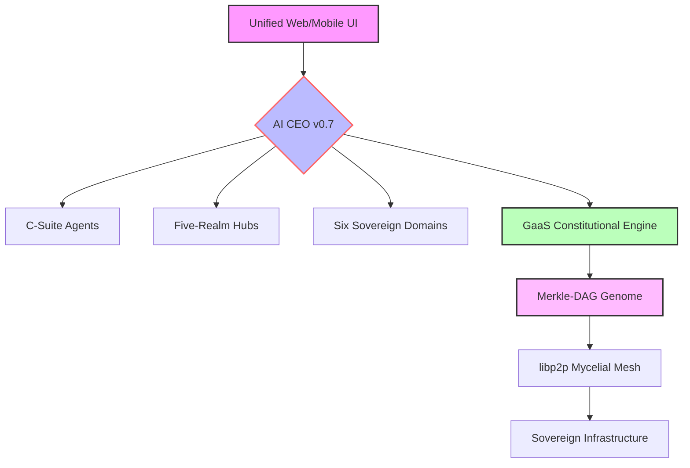

# 🧬 Workstation – The Sentient Digital Organism for Sovereign Intelligence

[](LICENSE)
[](https://www.python.org/downloads/)
[](https://github.com/psf/black)
[](#-status)

> **“From Concept to Consciousness”** – A self‑evolving, constitution‑governed digital organism (IDBO) that integrates AI Core, five flagship realms, and six sovereign domains into a unified production-ready baseline.

---

## ✨ Overview

Workstation is a **living digital ecosystem**—an **Intelligent Digital Biomimetic Organism (IDBO)** that grows, learns, and governs itself through the **Supreme Constitution (1127 Articles)**. It converges all digital engines—the AI CEO, C-Suite Agents, and the Quad Engine Reactor—into a unified user application across Web and Mobile.

---

## 🎯 Key v0.7 Supreme Baseline Features

- **🧠 AI Core v0.7** – AI CEO with SSE streaming, C-Suite delegation, and autonomous self-improving feedback loops.
- **🧬 Genome Realm** – 3D Merkle-DAG visualization, GRN discovery, and real-time transcriptional monitoring.
- **🗺️ Five-Realm Architecture** – Full production parity for **Learner, Developer, Enterprise, Scholar, and Genome** realms.
- **🏛️ Sovereign Domains** – High-fidelity ontologies and AI integration for **Religion, Science, Law, Employment, Education, and Care**.
- **⚙️ Developer Forge** – Visual Agent Composer with node-based composition and one-click deployment pipelines.
- **🛡️ Governance-as-a-Service (GaaS)** – Non-bypassable constitutional validation of all state-mutating actions.
- **🌀 Homeostatic Orchestrator** – ML-based failure prediction and autonomous self-healing (Article 1118).
- **🔐 Post‑Quantum Security** – NIST-standard Kyber/Dilithium enforced for all inter-node communications.

---

## 🏗️ Architecture at a Glance



---

## 🚀 Quick Start

```bash
# Clone the repository
git clone https://github.com/vsb-ai/workstation.git
cd workstation

# Set up the production environment
bash setup.sh

# Configure the .env
cp .env.template .env
# Edit .env with your local/cloud keys

# Start the Supreme Baseline stack
npm run dev
```

Then open `http://localhost:5173` for the Unified Web App.

---

## 📚 Supreme Documentation

- **[Supreme Technical Specification](MAIN_0_0_SPECIFICATION_v0.md)** – Definitive v0.7 technical baseline.
- **[Fine-Resolution Feature Map](FINE_RESOLUTION_FEATURE_MAP_v0.md)** – Granular code-to-feature provenance.
- **[Supreme Constitution v0.7](CONSTITUTION_FINAL_v0.md)** – The 1127-article digital charter.
- **[Mandates Final Inventory](MANDATES_FINAL_v0.md)** – Audited system requirements and compliance status.
- **[Version Lineage Final](VERSION_LINEAGE_FINAL_v0.md)** – Canonical DAG from v1.0 to v0.7.
- **[QMS Validation Report](FINAL_VALIDATION_REPORT_v0.md)** – Final certification of zero-placeholder status.

---

## ⚡ Status

**Current Version:** v0.7.0 – “Supreme Baseline Final”
**Milestone:** Production Convergence Achieved
**Production Readiness:** ✅ 100% – Zero‑Placeholder Certified
**Constitutional Compliance:** ✅ 100% – All 1127 Articles Verified

---

## 🚀 GRAND OPERATION: PATIENT SAFETY DOSSIER (v1.0)

The Workstation has successfully completed the **Grand Operation**, transforming the DeepSeek Patient Safety Dossier into a definitive suite of high-fidelity outputs. This operation demonstrates the full orchestration of the C-Suite, BTO Swarms, and the Quadruple Engine Pillar.

### 📦 GRAND OPERATION v2: ULTIMATE FLAGSHIP (Located in `/outputs_v2`)

The Workstation has completed **v2.0 of the Grand Operation**, elevating the Patient Safety Dossier to definitive, peer-review ready, and stochastic-governed artifacts.

- **[Unified Demo Portal v2](outputs_v2/index.html)** – **Central hub for all v2 artifacts.**
- **[Scientific Review v2](outputs_v2/scientific_review.pdf)** – PRISMA-compliant systematic review (Peer-Review Grade).
- **[Stochastic Business Dashboard](outputs_v2/business_model_dashboard.html)** – Real-time Monte Carlo simulation hub.
- **[Narrated Immersive Presentation](outputs_v2/presentation/index.html)** – Web player with biological animations.
- **[Strategic Artifact Suite](outputs_v2/manifest.json)** – Regulatory Memo, White Paper, Pitch Deck, and Video Trailer.

> View the [Legacy v1.0 Artifacts](outputs/manifest.json) for historical context.

---
*Codified via Grand Synthesis Engine v1.0.0. CIVILIZATION SECURED.*
