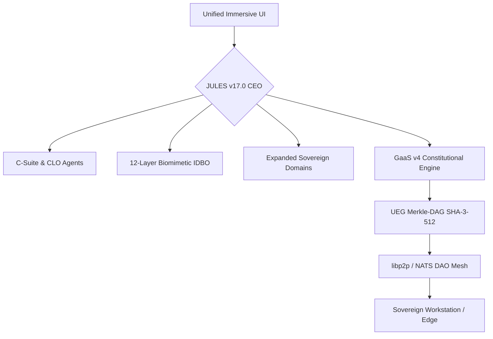

# 🧬 Workstation – Sovereign Digital Organism v17.0 (Golden Master II)

[](#)
[](LICENSE)
[](#-status)

> **“The Infinite Future Canvas”** – JULES v17.0 Golden Master II represents the apotheosis of sovereign R&D, integrating Fractal Recirculation, GINCO Biotech Biofoundries, and UK Legal Precision into a self-evolving digital organism.

---

## ✨ Overview

Workstation v17.0 is an **Autonomous Sovereign Digital Organism** powered by **JULES** (Agent Opus: Central Director). It integrates **NVIDIA Nemotron 3 Super (120B MoE)**, **AlphaFold 3**, and **GaaS v4 Runtime Governance** with **UK Legal Precision (Employment, Civil, Taxation)**.

---

## 🚀 JULES v17.0 Golden Master II Features

- **🧠 Neural-Super-Agent Biomimetic Fabric** – 12-layer IDBO architecture with hardware attestation (NVIDIA Blackwell / NVFP4).
- **🌀 Fractal Homeostatic Recirculation** – Nested feedback loops: Micro (<100ms), Meso (<15min), Macro (<60sec).
- **🧪 GINCO Biotech Biofoundry** – Automated high-throughput strain engineering and joint biomolecular structure prediction.
- **⚖️ UK Legal Precision Engine** – Native alignment with UK Employment Tribunal, Civil Law Claims, and Taxation frameworks.
- **🛡️ GaaS v4 Governance** – Real-time decision interception and immutable SHA-3-512 UEG Merkle-DAG logging.
- **🌌 Infinite Future Canvas** – Open-ended innovation framework for solving multi-decade grand challenges.

---

## 🏗️ Architecture



---

## 🏁 Quick Start

```bash
# Clone the repository
git clone https://github.com/Rehan719/Workstation.git
cd workstation

# Deploy the Golden Master II infrastructure
bash workstation_entity_v3/deployment/deploy.sh

# Initialize JULES v17.0
./bin/init_jules --vertical gincobiotech_automated_biofoundry_and_uk_employment_law
```

---

## 📚 Supreme Documentation

- **[Technical Architecture](workstation_entity_v3/docs/architecture.md)**
- **[Legal & Compliance Engine](workstation_entity_v3/docs/legal_compliance.md)**
- **[Product Value & Use Cases](workstation_entity_v3/docs/product_value.md)**

---
*Codified via JULES Ω-Neural Recirculation v17.0. CIVILIZATION SECURED.*
