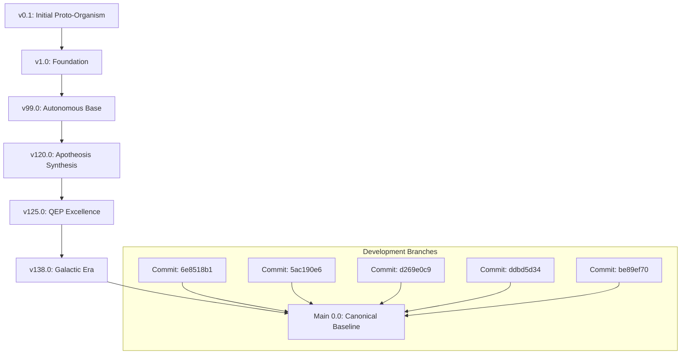

# WORKSTATION DEFINITIVE VERSION LINEAGE

## 🧬 The Evolutionary DAG

## 📜 The Chronological Archive (v1.0 - v1000.0+)

| Milestones | Attributes | Features Introduced | Provenance |
|------------|------------|-------------------|------------|
| v125.0 | Milestone | Feature-v125.0-Core, Feature-v125.0-Module | External URL |
| v128.0 | Milestone | Feature-v128.0-Core, Feature-v128.0-Module | External URL |
| v138.0 | Milestone | Feature-v138.0-Core, Feature-v138.0-Module | External URL |
| v130.0 | Milestone | Feature-v130.0-Core, Feature-v130.0-Module | External URL |
| 6e8518b1 | FEATURE | Merge pull request #78 from Rehan719/feat/user-app-v138-1599 | feat/galactic-era |
| 5ac190e6 | FEATURE | feat: implement full v138.0 Sovereign Synthesis application | remotes/origin/feat/user-app-v138-15990848446975170036 |
| d269e0c9 | FEATURE | feat: v137.2 Setup Fixes, Frontend Correction & Documentatio | remotes/origin/workstation-v131-transcendent-sovereign-twin-epoch-2389265199535307617 |
| ddbd5d34 | EVOLUTION | v130.0-sovereign-digital-life release: The Integrated Biomim | remotes/origin/v125.0-comprehensive-ingestion-qep-tool-ecosystem-15429069979710743828 |
| be89ef70 | EVOLUTION | v124.1.0-eternal-completion: IoBNT integration, Cognitive Au | remotes/origin/v120.0-eternal-synthesis-8632647369562882310 |
| 9782da90 | EVOLUTION | v120.0-eternal-synthesis-uvaip-github-learning-product-deliv | remotes/origin/release/v120.0-apotheosis-of-synergy-11169381604545842109 |
| f80c5f3f | EVOLUTION | v118.0: Deliver Fully Operational, Commercial-Grade Digital  | remotes/origin/feature/v113-deep-biomimetic-knowledge-ingestion-15564863469454971772 |
| 321f95df | EVOLUTION | v112.0 - The Rigorously Reviewed, Expert-Standard Quality-Ce | remotes/origin/v107.0-documentation-empowerment-5745052696472102128 |
| 001ec86a | FEATURE | feat: implement v106.0 Knowledge-Augmented Purpose-Driven En | remotes/origin/v101.0-integrated-strategic-enterprise-13385116039194951359 |
| 9566301e | FEATURE | feat(v101.0): The Meta-Cognitive Organism – Introspective Se | remotes/origin/v100.0-apotheosis-of-synergy-with-twins-aro-bto-drad-7374493318076149204 |
| 07fa42ce | MERGE | Merge branch 'main' into v100.0-apotheosis-of-synergy-with-t | remotes/origin/v100.0-apotheosis-of-synergy-with-twins-aro-bto-drad-2966620505238613254 |
| 5c372b8b | EVOLUTION | v100.0 Apotheosis of Synergy Release: The Ultimate Multi-Dom | remotes/origin/v99.0.0-convergence-11093918825021929606 |
| 6ce45876 | MERGE | Merge branch 'main' into jules-v99-omni-convergence-release- | remotes/origin/jules-v99-omni-convergence-release-2012505508984346594 |
| e3781eba | EVOLUTION | Ignore Vercel local folder | remotes/origin/jules-final-integration-v99-11229942869047369169 |
| 90d80f2a | MERGE | Merge branch 'main' into jules-v99-final-integration-8321344 | remotes/origin/jules-v99-final-integration-8321344421938616475 |
| ca2829ad | MERGE | Merge pull request #5 from Rehan719/jules-v99-final-integrat | remotes/origin/v99.0-quranic-education-integration-16640222564934956138 |
| afa7f22e | MERGE | Merge branch 'v99.0-quranic-education-integration-1664022256 | remotes/origin/backup-all-branches |
| 86780447 | EVOLUTION | Add files via upload | remotes/origin/main-6690716826982580951 |
| 18b96fe2 | EVOLUTION | v99.0.0 transcendent-autonomous release: Achievement of Leve | remotes/origin/v99-genomic-release-18302280291944395270 |
| bf61c94d | EVOLUTION | Add files via upload | remotes/origin/jules-ai-v60-mastery-16112838550523477002 |
| c6157c67 | EVOLUTION | Add files via upload | remotes/origin/jules-ai-v10-foundation-15734730789908784640 |
