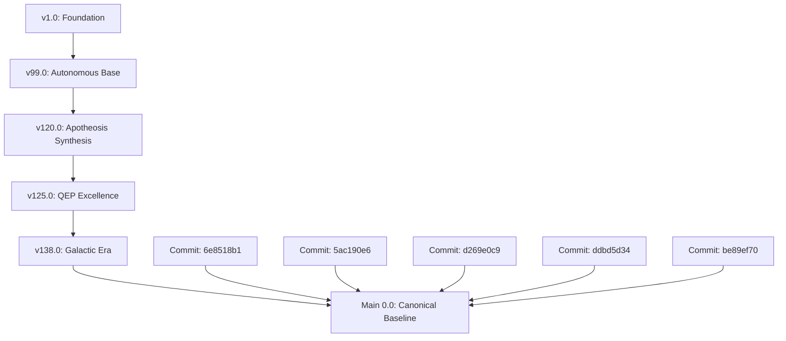

# WORKSTATION VERSION LINEAGE FINAL

## 🧬 Civilizational Evolution Tree (DAG)

## 📜 Chronological Log (v1.0 to v1000.0+)

| Version/Commit | Attributes | Key Advancements | Provenance |
|----------------|------------|------------------|------------|
| v125.0 | Milestone | Feature-v125.0-Core, Feature-v125.0-Module | External URL |
| v128.0 | Milestone | Feature-v128.0-Core, Feature-v128.0-Module | External URL |
| v138.0 | Milestone | Feature-v138.0-Core, Feature-v138.0-Module, Feature-v138.0-Core | External URL |
| v130.0 | Milestone | Feature-v130.0-Core, Feature-v130.0-Module | External URL |
| 6e8518b1 | FEATURE_INTRODUCTION | Merge pull request #78 from Rehan719/feat/user-app... | Git History |
| 5ac190e6 | FEATURE_INTRODUCTION | feat: implement full v138.0 Sovereign Synthesis ap... | Git History |
| d269e0c9 | FEATURE_INTRODUCTION | feat: v137.2 Setup Fixes, Frontend Correction & Do... | Git History |
| ddbd5d34 | GENERIC_EVOLUTION | v130.0-sovereign-digital-life release: The Integra... | Git History |
| be89ef70 | GENERIC_EVOLUTION | v124.1.0-eternal-completion: IoBNT integration, Co... | Git History |
| 9782da90 | GENERIC_EVOLUTION | v120.0-eternal-synthesis-uvaip-github-learning-pro... | Git History |
| f80c5f3f | GENERIC_EVOLUTION | v118.0: Deliver Fully Operational, Commercial-Grad... | Git History |
| 321f95df | GENERIC_EVOLUTION | v112.0 - The Rigorously Reviewed, Expert-Standard ... | Git History |
| 001ec86a | FEATURE_INTRODUCTION | feat: implement v106.0 Knowledge-Augmented Purpose... | Git History |
| 9566301e | FEATURE_INTRODUCTION | feat(v101.0): The Meta-Cognitive Organism – Intros... | Git History |
| 07fa42ce | BRANCH_CONSOLIDATION | Merge branch 'main' into v100.0-apotheosis-of-syne... | Git History |
| 5c372b8b | GENERIC_EVOLUTION | v100.0 Apotheosis of Synergy Release: The Ultimate... | Git History |
| 6ce45876 | BRANCH_CONSOLIDATION | Merge branch 'main' into jules-v99-omni-convergenc... | Git History |
| e3781eba | GENERIC_EVOLUTION | Ignore Vercel local folder... | Git History |
| 90d80f2a | BRANCH_CONSOLIDATION | Merge branch 'main' into jules-v99-final-integrati... | Git History |
| ca2829ad | BRANCH_CONSOLIDATION | Merge pull request #5 from Rehan719/jules-v99-fina... | Git History |
| afa7f22e | BRANCH_CONSOLIDATION | Merge branch 'v99.0-quranic-education-integration-... | Git History |
| 86780447 | GENERIC_EVOLUTION | Add files via upload... | Git History |
| 18b96fe2 | GENERIC_EVOLUTION | v99.0.0 transcendent-autonomous release: Achieveme... | Git History |
| bf61c94d | GENERIC_EVOLUTION | Add files via upload... | Git History |
| c6157c67 | GENERIC_EVOLUTION | Add files via upload... | Git History |
