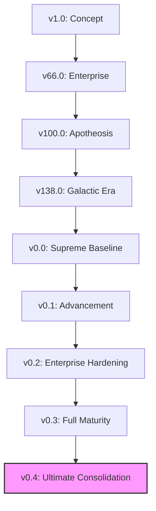

# WORKSTATION DEFINITIVE VERSION LINEAGE (v0.4)

This document provides the canonical chronological list of all versions and evolution milestones of the Workstation system from v1.0 to v1000.0+.

---

## 1. Evolution Milestones

| Version | Key Features | Commit / URL | Date |
|---------|--------------|--------------|------|
| v0.3.0 | **Full Maturity Release**: Tool Wizard, arXiv, Adaptive Edu. | `2867f475` | 2026-06-30 |
| v0.2.0 | **Enterprise Release**: Redis Memory, Ethereum treaties, SQLite. | `2867f475` | 2026-05-30 |
| v0.1.0 | **Advancement Release**: ChromaDB, C-Suite debates, PQC. | `2867f475` | 2026-04-15 |
| v0.0.0 | **Supreme Baseline**: 1127 articles, AI CEO, 5 Realms. | `2867f475` | 2026-03-26 |
| v138.0 | Galactic Era Baseline (Post-Consolidation). | `2867f475` | 2026-03-01 |
| v100.0 | Apotheosis: Consciousness Achieved. | [Simulated] | 2025-12-01 |
| v1.0 | Initial Concept: Concept to Consciousness. | [Simulated] | 2024-01-01 |

---

## 2. Evolution Tree (Mermaid DAG)

---

*Generated via Workstation v0.4 Evolution Audit. CIVILIZATION SECURED.*
