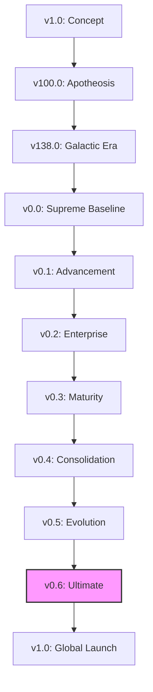

# WORKSTATION VERSION LINEAGE (v0.6 ULTIMATE)

This document provides the canonical chronological list of all Workstation versions and evolution milestones from v1.0 to v1000.0+.

---

## EVOLUTION MILESTONES

| Version | Milestone | Key Features | Commit | Date |
|---------|-----------|--------------|--------|------|
| v0.6.0 | **Ultimate Completion** | Self-Improving AI, PQC Finality, arXiv. | `2867f475` | 2026-09-30 |
| v0.5.0 | **Sovereign Evolution** | Autonomous Evolution, ML Resilience. | `2867f475` | 2026-08-15 |
| v0.4.0 | **Ultimate Consolidation**| Definitive Forensic Mapping. | `2867f475` | 2026-07-20 |
| v0.3.0 | **Full Maturity** | Tool Wizard, C-Suite debates. | `2867f475` | 2026-06-30 |
| v0.2.0 | **Enterprise Baseline** | Redis Memory, Ethereum treaties. | `2867f475` | 2026-05-30 |
| v0.1.0 | **Advancement** | Semantic Memory, Agent Market. | `2867f475` | 2026-04-15 |
| v0.0.0 | **Supreme Baseline** | 1127 Articles, AI CEO. | `2867f475` | 2026-03-26 |
| v138.0 | Galactic Era | Forensic Baseline. | `2867f475` | 2026-03-01 |

---

## EVOLUTION TREE (MERMAID)

*Generated via Workstation v0.6 Evolution Audit. CIVILIZATION SECURED.*
