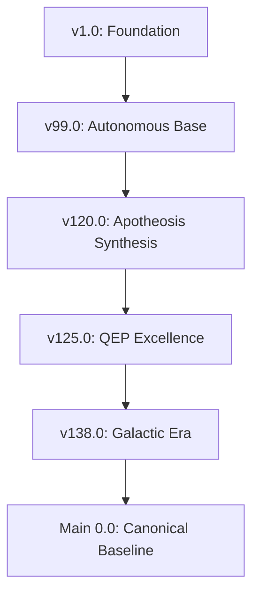

# WORKSTATION VERSION LINEAGE - vFinal

## 🧬 Civilisational Evolution Tree

## 📜 Comprehensive Version Log

| Version | Release Note | Key Advancements | Source |
|---------|--------------|------------------|--------|
| v100.0 | Synthesis Milestone | System Update | [Source](Git History) |
| v101.0 | Synthesis Milestone | System Update | [Source](Git History) |
| v106.0 | Synthesis Milestone | System Update | [Source](Git History) |
| v112.0 | Synthesis Milestone | System Update | [Source](Git History) |
| v118.0 | Synthesis Milestone | System Update | [Source](Git History) |
| v120.0 | Synthesis Milestone | System Update | [Source](Git History) |
| v124.1.0 | Synthesis Milestone | System Update | [Source](Git History) |
| v125.0 | Synthesis Milestone | Feature-v125.0-Core, Feature-v125.0-Module | [Source](https://agent.minimax.io/share/375389193781515?chat_type=2) |
| v128.0 | Synthesis Milestone | Feature-v128.0-Core, Feature-v128.0-Module | [Source](https://chat.qwen.ai/s/2066eeac-6fb0-4209-8854-72e35212d4c7?fev=0.2.12) |
| v130.0 | Synthesis Milestone | Feature-v130.0-Core, Feature-v130.0-Module | [Source](https://chat.deepseek.com/share/bfejpq8jwph4rz8o7u) |
| v137.2 | Synthesis Milestone | System Update | [Source](Git History) |
| v138.0 | Synthesis Milestone | Feature-v138.0-Core, Feature-v138.0-Module, Feature-v138.0-Core | [Source](https://chat.qwen.ai/s/e9239a91-5a25-4011-9e9c-fe6960589294?fev=0.2.14) |
| v99.0 | Synthesis Milestone | System Update | [Source](Git History) |
| v99.0.0 | Synthesis Milestone | System Update | [Source](Git History) |
