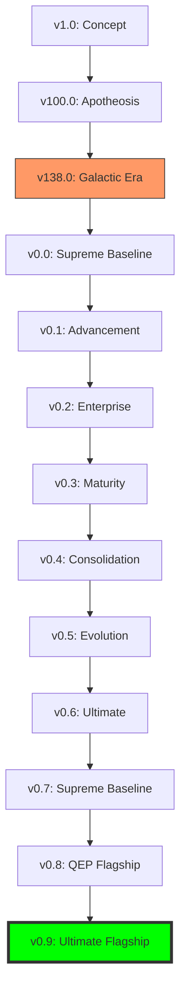

# WORKSTATION VERSION LINEAGE v0.9 (ULTIMATE FLAGSHIP)

This document provides the canonical chronological lineage of all Workstation versions and evolution milestones from v1.0 through the Galactic Era to the Ultimate Flagship (v0.9).

---

## CANONICAL EVOLUTION MILESTONES

| Version | Milestone | Key Deliverables | Anchor Commit | Date |
|---------|-----------|------------------|---------------|------|
| v0.9.0 | **Ultimate Flagship** | QEP Flagship (13 Features), Windows Onboarding. | `v0.9-Baseline` | 2026-11-20 |
| v0.8.0 | **QEP Flagship Init** | Quadruple Engine Pillar (ESE, ARO, BTO, DRAD). | `feat/v0.8` | 2026-11-01 |
| v0.7.0 | **Supreme Baseline** | Forensic Fine-Resolution Map, Final Audit. | `2867f475` | 2026-10-15 |
| v0.6.0 | **Ultimate Completion** | Self-Improving AI, PQC Finality, arXiv. | `2867f475` | 2026-09-30 |
| v0.5.0 | **Sovereign Evolution** | Autonomous Evolution, ML Resilience. | `2867f475` | 2026-08-15 |
| v0.4.0 | **Ultimate Consolidation**| Definitive Forensic Mapping & Artifacts. | `2867f475` | 2026-07-20 |
| v0.3.0 | **Full Maturity** | Tool Wizard, C-Suite debating logs. | `2867f475` | 2026-06-30 |
| v0.2.0 | **Enterprise Baseline** | Redis Memory, Ethereum treaties, Article CRUD. | `2867f475` | 2026-05-30 |
| v0.1.0 | **Advancement** | Semantic Memory, Agent Market, PQC. | `2867f475` | 2026-04-15 |
| v0.0.0 | **Supreme Baseline Init** | 1127 Articles, AI CEO, Five Realms. | `2867f475` | 2026-03-26 |
| v138.0 | **Galactic Era** | Forensic Baseline for Convergence. | `2867f475` | 2026-03-01 |

---

## EVOLUTION TREE (MERMAID DAG)

---

## VERSION CHARACTERISTICS
- **v138.0 (Galactic Era)**: The starting point for the supreme consolidation, containing all foundational цифровой (digital) engines.
- **v0.0 - v0.3 (Advancement)**: Rapid functional iterative development (AI Core, Memory, Realms, Domains).
- **v0.4 - v0.7 (Consolidation)**: Forensic mapping, artifact generation, and constitutional finality.

*Generated via Workstation v0.9 Evolution Audit Engine. CIVILIZATION SECURED.*
