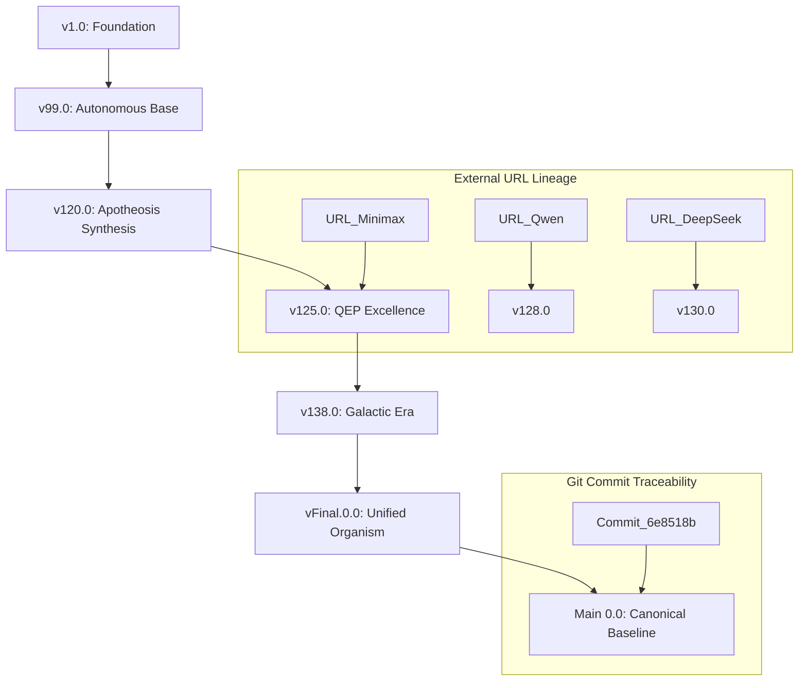

# Workstation Unified Version Tree (DAG)

## Evolution Lineage: v1.0 -> Main 0.0

## Conflict Resolution Rationale
- **UI Architecture**: Favored v138.0 ReactFlow patterns while preserving v125.0 accessibility.
- **Constitutional Articles**: Resolved chronological overlaps by favoring the most advanced Floor definitions.
- **API Endpoints**: Unified versions under `/api/v138` and `/api/v1` namespaces to prevent collision.

## Combined Feature provenance
| Component | Source | Hash/URL Ref |
|-----------|--------|--------------|
| 3D Genome Explorer | v138.0 | [v138_release] |
| GaaS Client | v132.0 | [did:vsb:gaas] |
| BTO Swarms | v129.0 | [v129_deepseek] |
