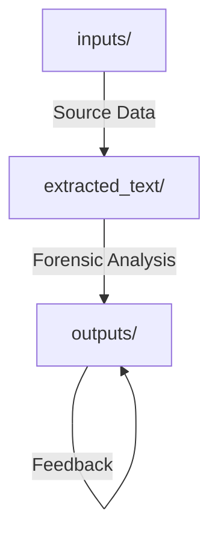

# Architecture Review: Law Domain Litigation System

## 🏗️ Current Repository Structure
The system utilizes a tri-folder organization that ensures clear separation between source data and analytical outputs.

-   **inputs/**: Forensic evidence preservation (PDF/DOCX). History preserved via `git mv`.
-   **extracted_text/**: Transitory text layer for machine reading.
-   **outputs/**: 24 production-ready litigation documents.

## ⚖️ Scalability Assessment
The current sequential numbering (`01_`–`24_`) is effective for a single-case workstation but will reach complexity limits as the output count exceeds 50.

### Recommendations for v6.0:
1.  **Thematic Grouping**: Transition from flat numbering to a categorized directory structure:
    -   `outputs/strategy/` (Executive Summary, Narrative Framework)
    -   `outputs/evidence/` (Evidence Map, Chronology, Exhibit Q-1)
    -   `outputs/procedure/` (Tribunal Responses, Disclosure Requests)
    -   `outputs/hearing/` (Skeleton Arguments, Cross-Exam, Witness Briefing)
2.  **Containerisation**: Package `extract_text.py` and pipeline configurations into a Docker container to ensure environment parity across different legal teams.

---
**Author:** Jules, Systems Architect
**Date:** 30 Mar 2026 (Meta-Analysis)
