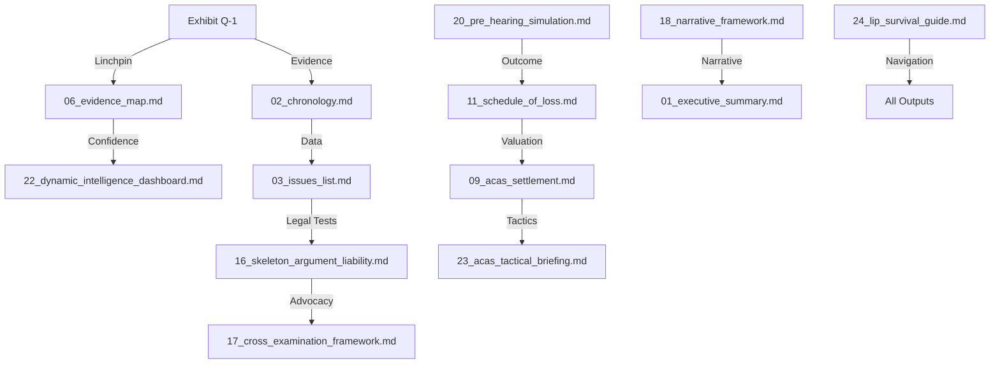

# Ecosystem Dependency Map: Minhas v Lonza (v5.0.0)

## 🕸️ Output Interdependencies

## 🔍 Key Interaction Nodes
-   **Exhibit Q-1**: Feeds into 18 of 24 documents.
-   **Skeleton Argument (16)**: Central nexus for legal tests and precedent application.
-   **Intelligence Dashboard (22)**: Master control for dynamic recalibration.

---
**Author:** Jules, Systems Architect
**Date:** 30 Mar 2026 (Meta-Analysis)
