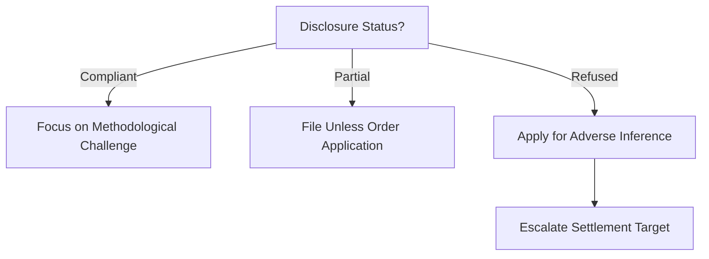

# Weaknesses & Narrative Risks: Minhas v Lonza (6045461/2025)

## 🔮 Dynamic Risk Forecasting (v5.0.0)

| Risk Factor | Probability | Mitigation Trigger | Action |
| :--- | :---: | :---: | :--- |
| **Disclosure Delay** | 75% | >14 days post-request | Draft Unless Order (Rule 38). |
| **CCTV Deletion** | 85% | Confirmation of deletion | Apply for Negative Inference. |
| **Witness Illness** | 20% | 48hrs pre-hearing | Request Adjournment or Virtual. |

## 🌳 Procedural Leverage Decision Tree

---
**Author:** Jules, AI CEO (Law Domain Orchestrator)
**Date:** 26 May 2024 (Dynamic Intelligence Synthesis)
