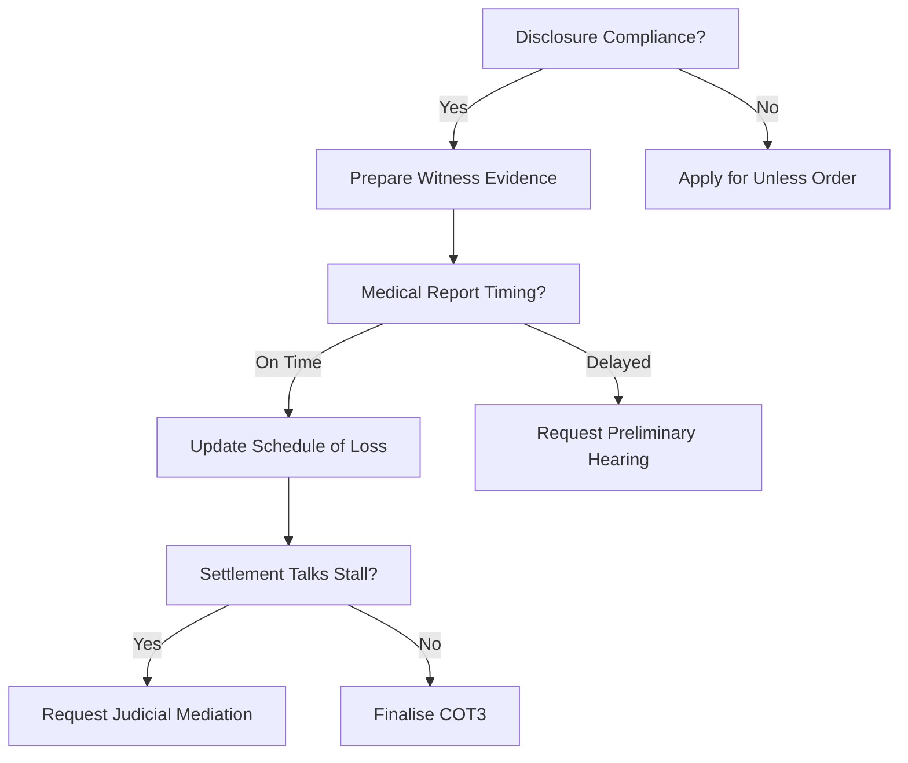

# Weaknesses & Risks: Minhas v Lonza Biologics Plc (6045461/2025)

## 🌳 Procedural Decision Tree

## ⚠️ Weaknesses & Risks Matrix (Ultimate Refinement)

| Risk / Weakness | Impact | Mitigation Owner | Trigger Condition |
| :--- | :---: | :---: | :--- |
| **1. Probationary Defense** | High | Law CoE | Respondent relies on "capability" in witness statements. |
| **2. SAR Procedural Delay** | Med | CTO | 30 days pass without disclosure of the "Excel file." |
| **3. CCTV Deletion** | High | CTO | Respondent confirms footage was deleted per 30-day policy. |
| **4. Mitigation of Loss** | Med | CFO | Respondent requests job search log in cross-examination. |

## 📉 Strategic Mitigation
-   **If CCTV deleted:** Apply for a "Negative Inference" direction from the Judge, arguing the Respondent failed to preserve evidence after the 6 Oct legal hold.
-   **If SAR refused:** Cite *Jameel* proportionality but emphasize the file's central role in the discrimination claim.

---
**Author:** Jules, AI CEO (Law Domain Orchestrator)
**Date:** 25 May 2024 (Ultimate Readiness Analysis)
