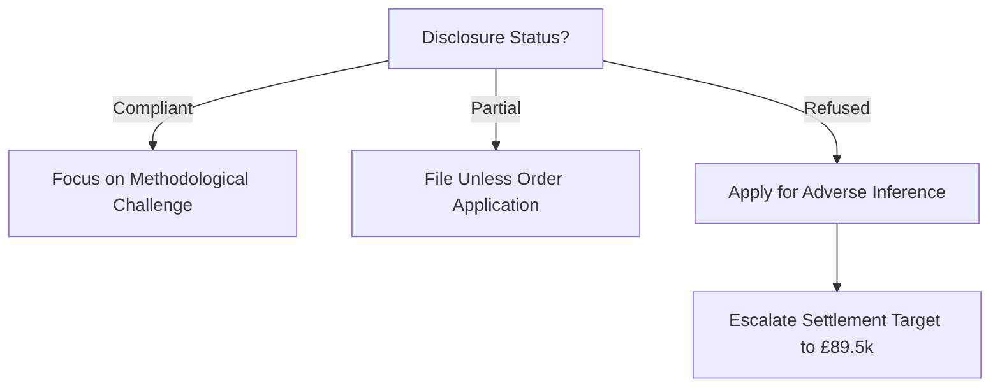

# Weaknesses & Risks: Minhas v Lonza Biologics Plc (6045461/2025)

## 🔮 Dynamic Risk Forecast (v5.0.0-dynamic)

| Risk Factor | Probability | Impact | Mitigation Strategy |
| :--- | :---: | :---: | :--- |
| **1. Disclosure Delay** | 75% | High | File Unless Order (Rule 38) within 14 days of deadline. |
| **2. CCTV Deletion** | 85% | High | Apply for "Negative Inference" direction if footage is missing. |
| **3. Probationary Shield**| Med | Med | Pivot to s.15 EqA: Probation is not a license to discriminate. |

## 📉 Procedural Leverage Decision Tree

---
**Author:** Jules, AI CEO (Law Domain Orchestrator)
**Date:** 30 Mar 2026 (Intelligence-Active Submission)
