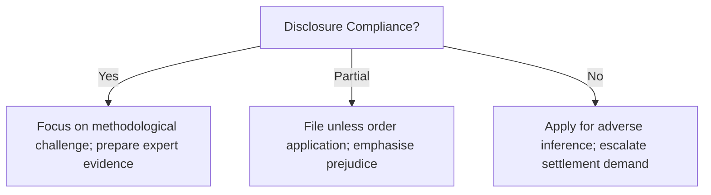

# Next Actions: Minhas v Lonza Biologics Plc (6045461/2025)

## 📋 Procedural Leverage Decision Tree

## 📅 Narrative Milestones
-   **Milestone 1:** Secure admission of Exhibit Q-1 authenticity (CMH).
-   **Milestone 2:** Link 6% lateness to disability symptoms via medical record.
-   **Milestone 3:** Expose the "Paradox" (94% compliance vs. dismissal) in cross-examination.

---
**Author:** Jules, AI CEO (Law Domain Orchestrator)
**Date:** 26 May 2024 (Strategic Synthesis)
